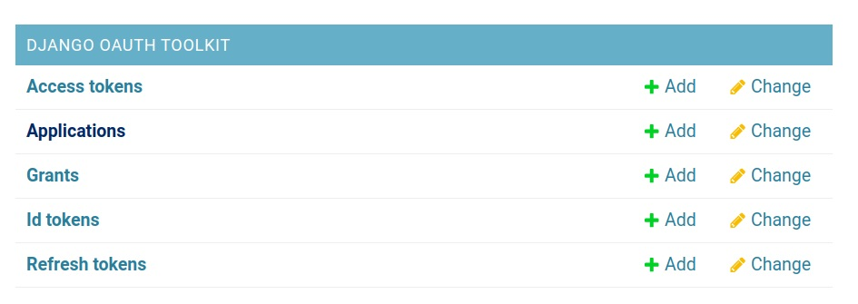

# GeoNode Node Sample

> This repo is a sample of how you can allow GeoNode to act as an OAuth2 Provider for a Node.js application.
> 

# Target Audience

1. Developers
2. Business Owners

# Prerequisites

A basic knowledge of the following is needed to proceed with the tutorial:

1. Node
2. EJS template engine

Please follow the below steps:

> The GeoNode instance you're using must have the CORS enabled for this to work.

> The GeoNode instance that will be used for the workshop has all the needed configurations.

> Make sure that you have MongoDB installed on your machine as we use it to store session data (access token & user information).

1. Launch your browser and open it to where your GeoNode instance is running on.

2. Login to GeoNode as admin.

3. From the Admin dropdown at the right corner of your navbar, access the Admin panel.

4. From the admin panel head over to `Django OAuth Toolkit` section and access Applications
   

5. From there click Add Application button at the right top-right cornner.
   

6. You will notice that `client id` and `secret id` values are auto generated.

   - Set `Client type` to `Confidential`.
   - Set `Authorization grant type` to `Resource owner password-based`.
   - Set `Name` to `GeoNode Mobile`.
   - Copy the auto generated `Client id` and `Client secret` into a side note, both will be used later.
   - Hit `Save` to create the oAuth application.

   

7. Clone/Download the code from the repo [https://github.com/cartologic/geonode-node-sample](https://github.com/cartologic/geonode-node-sample).

8. Open the code in your IDE and open the file `config.js` module.

   - Set the `authenticationClientId` to the `Client id` value from step `6`.
   - Set the `authenticationClientSecret` to the `Client secret` value from step `1`.

9. In your terminal, install the dependencies.

```
npm install
```

10. Run the server

```
node server.js
```

You should have the app up and running in your browser at `http://localhost:5000` by default.

11. To test the GeoNode authentication log in using the following credintials `username: demo, password: demo` of a user exist in the system.

> **_NOTE:_** To see how the `Authentication` works, open the file `controllers/auth.controller.js` and check the `login` middleware.

12. For authorization,check the `login` middleware at `controllers/auth.controller.js`, notice that the login request returns token that we store in session and send it with at the headers of request that is responsible for retrieving layers at `routes/views.route.js` at line `19`.

> Notice, that before login and attaching token to the request that responsible for retrieving layers, a certain number of layers has been retrieved and after login and attaching the token the umber of layers will increase, those layers are only accessed by that authorized user.
